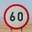
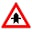
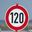

# **Traffic Sign Recognition**

**Build a Traffic Sign Recognition Project**
---
The goals / steps of this project are the following:
* Load the data set (see below for links to the project data set)
* Explore, summarize and visualize the data set
* Design, train and test a model architecture
* Use the model to make predictions on new images
* Analyze the softmax probabilities of the new images
* Summarize the results with a written report

---
### Writeup / README

You're reading it! and here is a link to my [project code](https://github.com/musabafzal/Traffic-Sign-Classifier/blob/master/Traffic_Sign_Classifier.ipynb)

### Data Set Summary & Exploration

#### 1. Provide a basic summary of the data set and identify where in your code the summary was done. In the code, the analysis should be done using python, numpy and/or pandas methods rather than hardcoding results manually.

The code for this step is contained in the second code cell of the IPython notebook.  

I used the pandas and numpy library to calculate summary statistics of the traffic
signs data set:

* The size of training set is 34799
* The size of test set is 12630
* The shape of a traffic sign image is 32x32x3
* The number of unique classes/labels in the data set is 43

#### 2. Include an exploratory visualization of the dataset and identify where the code is in your code file.

The code for this step is contained in the third code cell of the IPython notebook.

Here is an exploratory visualization of the data set. It is a bar chart visualizing the number of images present in the dataset of each of the 43 unique classes. The number of images for the classes vary by a large margin meaning a skewed dataset which can affect the results of our network.
I can try to correct it by generating fake data for the classes with less number of examples to lessen the skewness of the data but I will first check the model with the existing dataset and check the accuracy.

### Design and Test a Model Architecture

#### 1. Describe how, and identify where in your code, you preprocessed the image data. What tecniques were chosen and why did you choose these techniques? Consider including images showing the output of each preprocessing technique. Pre-processing refers to techniques such as converting to grayscale, normalization, etc.

The code for this step is contained in the fourth code cell of the IPython notebook.

As a first step, I decided to convert the images to grayscale because after analyzing some of the images I reached to the conclusion that the model will not be able to gain much information from the rgb images and rgb images will only slow the model down without improving it accuracy as much. I used OpenCV to grayscale the images and used numpy’s “newaxis” feature to give it a depth the images a depth of 1 to make them compatible with the lenet model.

Here is an example of a traffic sign image before and after grayscaling.

As a last step, I normalized the image data between .1 and .9, so that I could keep numerical stability. This scales down the disparity within the data. Using .1 also avoids any potential problems incurred by allowing the data down to zero which can prove harmful for our model.

#### 2. Describe how, and identify where in your code, you set up training, validation and testing data. How much data was in each set? Explain what techniques were used to split the data into these sets.
The data was also shuffled so that the data for a class will not be clustered together.
My final training set had 34799 number of images. My validation set and test set had 4410 and 12630 number of images.

#### 3. Describe, and identify where in your code, what your final model architecture looks like including model type, layers, layer sizes, connectivity, etc.) Consider including a diagram and/or table describing the final model.

The code for my final model is located in the fifth cell of the ipython notebook.

My final model consisted of the following layers:

| Layer         		|     Description	        					|
|:---------------------:|:---------------------------------------------:|
| Input         		| 32x32x1 Grayscaled image   							|
| Convolution    	| 1x1 stride, valid padding, outputs 28x28x6 	|
| RELU					|												|
| Max pooling	      	| 2x2 stride,  outputs 14x14x16 				|
| Convolution	    | 1x1 stride, valid padding, outputs 10x10x16 								|
|RELU|
| Max pooling	      	| 2x2 stride,  outputs 5x5x16 				|
|Flatten |  outputs 400|
| Fully connected		|  outputs 200       					|
|RELU|
|Dropout| 65% keep probability|
| Fully connected		|  outputs 100       					|
|RELU|
|Dropout| 65% keep probability|
| Fully connected		|  outputs 43       					|
| Softmax				|    									|

#### 4. Describe how, and identify where in your code, you trained your model. The discussion can include the type of optimizer, the batch size, number of epochs and any hyperparameters such as learning rate.

The code for training the model is located in the sixth cell of the ipython notebook.

I utilized the AdamOptimizer from within TensorFLow to optimize. I tried a few different batch sizes, but settled at 128 performed the best so I choose 128 as my batch size. I ran 15 epochs, because it took the least time and the accuracy started to decline after 15 epochs, or there was only marginal increase in the accuracy if I increased it any further while the training time was increasing with a great amount.

For the model hyperparameters, I stuck with a mean of 0 and standard deviation/sigma of 0.1. I also choose a learning rate of 0.005 for the first 60% of the iterations and then I dropped it down to 0.001 as it performed best for me because the model need to minimize the loss quickly at first and then slow down to reach an optimal minimum point.

#### 5. Describe the approach taken for finding a solution. Include in the discussion the results on the training, validation and test sets and where in the code these were calculated. Your approach may have been an iterative process, in which case, outline the steps you took to get to the final solution and why you chose those steps. Perhaps your solution involved an already well known implementation or architecture. In this case, discuss why you think the architecture is suitable for the current problem.

The code for calculating the accuracy of the model is located in the sixth cell of the Ipython notebook.

Firstly, I modified the Lenet architecture to different combinations of hidden and convolutional layers and then stuck to 2 convolutional and 3 fully connected layers. Then I experimented with the number of output nodes in my fully connected layers and for me the 200 output nodes in fully connected layer 1 and 100 output nodes in fully connected layer 2 provided the best results. However, the accuracy was still stuck at 93% on my validation set.

After that, I added dropout technique in my fully connected layers of the neural network because I realized the network was over fitting, I experimented with different keep probabilities of the dropout layer and reached to the conclusion that 0.65 keep probability works best and improved the accuracy to around 96% on my validation set and 93% on my test set. I also kept the learning rate 0.005 for first 60% of the epochs and then dropped it down 0.001 for the rest which made my network more stable.

### Test a Model on New Images

#### 1. Choose atleast five German traffic signs found on the web and provide them in the report. For each image, discuss what quality or qualities might be difficult to classify.

Here are six German traffic signs that I found on the web:

The first image might be difficult to classify because the speed limit signs are pretty much the same and the size of the sign in the image may be different than the training set.

The second image might be difficult to classify because the size of the sign in the image may be different than the training set and the brightness or contrast of the image may be different than the images present in the training set.

The third image might be difficult to classify because the size of the sign in the image may be different than the training set and the brightness or contrast of the image may be different than the images present in the training set.

The fourth image might be difficult to classify because the size of the sign in the image may be different than the training set and the brightness is different than the images present in the training set.

The fifth image might be difficult to classify because the speed limit signs are pretty much the same and the size of the sign in the image may be different than the training set.

The sixth image might be difficult to classify because the size of the sign in the image may be different than the training set and the brightness or contrast of the image may be different than the images present in the training set.

#### 2. Discuss the model's predictions on these new traffic signs and compare the results to predicting on the test set. Identify where in your code predictions were made. At a minimum, discuss what the predictions were, the accuracy on these new predictions, and compare the accuracy to the accuracy on the test set.

The code for making predictions on my final model is located in the eighth cell of the Ipython notebook.

Here are the results of the prediction:

| Image			        |     Prediction	        					|
|:---------------------:|:---------------------------------------------:|
| 60 km/h      		| 60 km/h   									|
| Yield     			| Yield 										|
| Right of Way					| Right of Way											|
| Road Work	      		| Road Work						 				|
| 120km/h			|  120km/h      							|
| Stop			|  Stop      							|

The model was able to correctly guess 6 of the 6 traffic signs, which gives an accuracy of 100%. This compares favorably to the accuracy on the test set of 93.1%.

#### 3. Describe how certain the model is when predicting on each of the five new images by looking at the softmax probabilities for each prediction and identify where in your code softmax probabilities were outputted. Provide the top 5 softmax probabilities for each image along with the sign type of each probability.

The code for making predictions on my final model is located in the eighth and last cell of the Ipython notebook.

For the first image, the model is relatively unsure that this is a speed limit(60h/h) sign as the probabilities of 60 km/h and ahead only sign are pretty close. The top five soft max probabilities were

| Probability         	|     Prediction	        					|
|:---------------------:|:---------------------------------------------:|
| .16         			| Speed limit (60km/h)   									|
| .12     				| Ahead only 										|
| .07					| Speed limit (80km/h)											|
| .05      			| No passing for vehicles over 3.5 metric tons					 				|
| .05			    | No passing      							|

For the second image, the model is relatively sure that this is a yield sign as its probability is 0.55 and the next probability is much lower than the first one. The top five soft max probabilities were

| Probability         	|     Prediction	        					|
|:---------------------:|:---------------------------------------------:|
| .55         			| Yield   									|
| .15     				| Ahead only 										|
| .09					| Speed limit (50km/h)											|
| .05	      			| Turn right ahead					 				|
| .04			    | Keep right     							|

For the third image, the model is relatively sure that this is a right of way at the intersection sign as its probability is 0.32 and the next probability is much lower than the first one. The top five soft max probabilities were

| Probability         	|     Prediction	        					|
|:---------------------:|:---------------------------------------------:|
| .32         			| Right-of-way at the next intersection   									|
| .05     				| Pedestrians 										|
| .006					| Priority road											|
| -.007	      			| Beware of ice/snow					 				|
| -.07				    | General caution      							|

For the fourth image, the model is relatively unsure that this is a road work sign as there is not a big difference in the probabilities of the other signs. The top five soft max probabilities were

| Probability         	|     Prediction	        					|
|:---------------------:|:---------------------------------------------:|
| .12         			| Road work   									|
| .08     				| General caution 										|
| .07					| Bicycles crossing										|
| .07	      			| Road narrows on the right					 				|
| .04				    | Traffic signals     							|

For the fifth image, the model is relatively sure that this is a speed limit (120 km/h) sign as its probability is 0.29 and the next probability is much lower than the first one. The top five soft max probabilities were

| Probability         	|     Prediction	        					|
|:---------------------:|:---------------------------------------------:|
| .29         			| Speed limit (120km/h)   									|
| .15     				| Speed limit (100km/h) 										|
| .0.008					| No passing											|
| -.06	      			| No vehicles					 				|
| -.06				    | Roundabout mandatory     							|

For the sixth image, the model is relatively sure that this is a stop sign as its probability is 0.16 and the next probability is much lower than the first one. The top five soft max probabilities were

| Probability         	|     Prediction	        					|
|:---------------------:|:---------------------------------------------:|
| .16         			| Stop sign   									|
| .05     				| Keep right									|
| .02					| No vehicles											|
| .02	      			| Speed limit (50km/h)					 				|
| .01				    | Turn right ahead      							|
